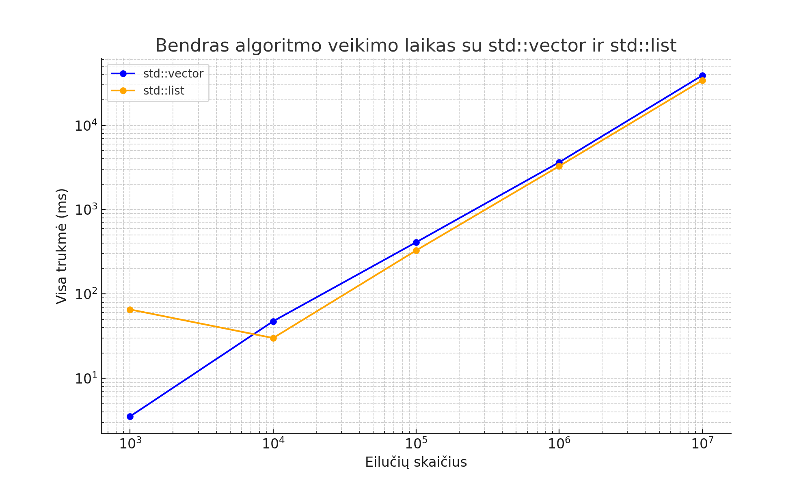

Procesorius(CPU): AMD Ryzen 5 6600H, 12 CPUs

Atmintis(RAM): 7.4 GB RAM

Kietas Diskas(HDD): HDD

# Algoritmo greičio palyginimas naudojant `std::vector`

## Greičio eksperimentai naudojant `vector` ir `class` su O3 optimizacijos lygiu

| Failo dydis       | Nuskaitymas (ms) | Rūšiavimas (ms) | Galutinių pažymių skaičiavimas (ms) | Grupavimas (ms) | Silpnųjų išvedimas (ms) | Protingųjų išvedimas (ms) | Visa trukmė (ms) |
|--------------------|------------------|-----------------|-------------------------------------|----------------|--------------------------|---------------------------|-----------------|
| 1000              | 2.68707         | 0.726494        | 0.035843                            | 0.171081       | 2.51177                 | 3.42851                  | 9.56095         |
| 10000             | 19.7543         | 11.4364         | 0.351355                            | 1.71864        | 21.6844                 | 31.2471                  | 86.1924         |
| 100000            | 151.754         | 114.408         | 2.94838                             | 13.1127        | 192.857                 | 273.531                  | 748.61          |
| 1000000           | 1563.18         | 1582.81         | 29.1966                             | 160.248        | 2036.27                 | 3037.98                  | 8409.68         |
| 10000000          | 16598.9         | 19830.2         | 357.431                             | 2088.27        | 21899                   | 30332.8                  | 91106.6         |

## Greičio eksperimentai naudojant `vector` ir `class` su O2 optimizacijos lygiu

| Failo dydis       | Nuskaitymas (ms) | Rūšiavimas (ms) | Galutinių pažymių skaičiavimas (ms) | Grupavimas (ms) | Silpnųjų išvedimas (ms) | Protingųjų išvedimas (ms) | Visa trukmė (ms) |
|--------------------|------------------|-----------------|-------------------------------------|----------------|--------------------------|---------------------------|-----------------|
| 1000              | 2.78705         | 0.735762        | 0.0368655                           | 0.177443       | 19.6912                 | 26.5458                  | 49.9744         |
| 10000             | 18.2894         | 10.9164         | 0.346626                            | 1.70021        | 21.2331                 | 30.11                    | 82.596          |
| 100000            | 149.104         | 117.168         | 3.01172                             | 13.8372        | 203.08                  | 272.354                  | 758.555         |
| 1000000           | 1548.27         | 1569.17         | 30.4004                             | 155.644        | 2082.84                 | 2969.25                  | 8355.57         |
| 10000000          | 17013           | 19958.5         | 366.21                              | 1771.79        | 21437                   | 30029.8                  | 90576.4         |

## Greičio eksperimentai naudojant `vector` ir `class` su O1 optimizacijos lygiu

| Duomenų kiekis     | Failo nuskaitymas (ms) | Rūšiavimas (ms) | Galutinių pažymių skaičiavimas (ms) | Skirstymas į dvi grupes (ms) | Silpnųjų mokinių išvedimas (ms) | Protingų mokinių išvedimas (ms) | Visa trukmė (ms) |
|---------------------|------------------------|-----------------|------------------------------------|-----------------------------|--------------------------------|---------------------------------|------------------|
| 1,000              | 1.96337               | 0.764848        | 0.038779                          | 0.179266                   | 19.5932                       | 27.6722                        | 50.212           |
| 10,000             | 19.0948               | 10.9801         | 0.366929                          | 1.81686                    | 21.3162                       | 30.3512                        | 83.9266          |
| 100,000            | 157.769               | 121.056         | 3.2656                            | 14.2163                    | 192.1                         | 271.624                        | 760.032          |
| 1,000,000          | 1636.35               | 1594.48         | 32.4052                           | 142.731                    | 1972.15                       | 2772.42                        | 8150.53          |
| 10,000,000         | 16140.1               | 19724.5         | 358.125                           | 1719.97                    | 21830.8                       | 30006.1                        | 89779.6          |

# Klasių ir struktūrų veikimo greičio palyginimas

Toliau pateikta lentelė palygina klasių ir struktūrų naudojimą atliekant įvairias operacijas, įskaitant failo nuskaitymą, rikiavimą, galutinių pažymių skaičiavimą, grupavimą, silpnųjų ir protingųjų studentų išvedimą, bei bendrą veikimo trukmę. 

## Palyginimo rezultatai

| Eilučių kiekis | Operacija                 | Struktūra (ms) | Klasė (ms) | Skirtumas (%) |
|----------------|---------------------------|----------------|------------|---------------|
| **100,000**    | Failo nuskaitymas         | 162.39         | 176.044    | +8.41         |
|                | Rūšiavimas                | 237.227        | 289.916    | +22.22        |
|                | Galutinių pažymių skaičiavimas | 10.0711   | 9.36294    | -7.04         |
|                | Grupavimas                | 30.1741        | 23.7894    | -21.16        |
|                | Silpnųjų išvedimas        | 115.13         | 144.412    | +25.45        |
|                | Protingųjų išvedimas      | 161.405        | 172.422    | +6.83         |
|                | **Visa trukmė**           | **716.401**    | **815.951**| **+13.92**    |
| **1,000,000**  | Failo nuskaitymas         | 1444.15        | 1497.55    | +3.69         |
|                | Rūšiavimas                | 2997.06        | 3510.63    | +17.15        |
|                | Galutinių pažymių skaičiavimas | 94.0012   | 93.4055    | -0.63         |
|                | Grupavimas                | 353.791        | 274.824    | -22.31        |
|                | Silpnųjų išvedimas        | 1215.5         | 1187.11    | -2.33         |
|                | Protingųjų išvedimas      | 1627.72        | 1746.56    | +7.30         |
|                | **Visa trukmė**           | **7732.24**    | **8310.08**| **+7.47**     |

---

## Išvados
1. **Bendras veikimo laikas**: Struktūros yra šiek tiek greitesnės nei klasės (ypač esant mažesniam duomenų kiekiui).
2. **Rūšiavimas ir silpnųjų išvedimas**: Šiose operacijose klasės yra lėtesnės nei struktūros.
3. **Grupavimas**: Grupavimo metu klasės pasižymi didesniu efektyvumu.
4. **Dideli duomenų kiekiai**: Esant 1,000,000 eilučių, skirtumai tarp struktūrų ir klasių sumažėja, tačiau struktūros išlieka šiek tiek greitesnės.

